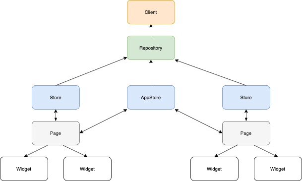

# gottiesclient

おうちハッカソン。

## アプリアーキテクチャ

### Client

Firestore, API サーバーと通信をします。

### Repository

任意の Client を保持して、Client からデータを取得します。

### Store

主に画面ごとに作成し、画面で使う情報を Repository から取得し、保持します。
変更を通知する必要がある場合は `ChangeNotifier` を継承します。

例外として、`AppStore` を作成します。
`AppStore` は画面を跨いで保持する必要のある情報や、通知を管理する `Store` とします。

### Page

1 画面ごとに作成します。
肥大化してしまう場合は各 `page` パッケージ内に `widgets` パッケージを切ってそこに切り出します。

### Widget

画面の部品。

各画面ごとの Widget と アプリ全体で使い回す Widget があります。

## アプリ配布

アプリの配布に Firebase AppDistribution を使用しています。
手元の環境でのビルド成果物を配布したい場合は、 `.env.example` を `.env` にコピーし、必要な情報を入力した上で `bundle exec fastlane android distribute_app` を実行してください。

### 各設定値について

#### `FIREBASE_APP_ID_IOS`

Firebase で iOS アプリを登録した際の App ID

#### `FIREBASE_APP_ID_ANDROID`

Firebase で Android アプリを登録した際の App ID

#### `FIREBASE_CLI_TOKEN`

`firebase login:ci` で取得した Firebase のトークン

#### `IPA_PATH`

iOS のビルド成果物へのパス

※ 現在はアップロードできません。

#### `APK_PATH`

Android のビルド成果物へのパス
